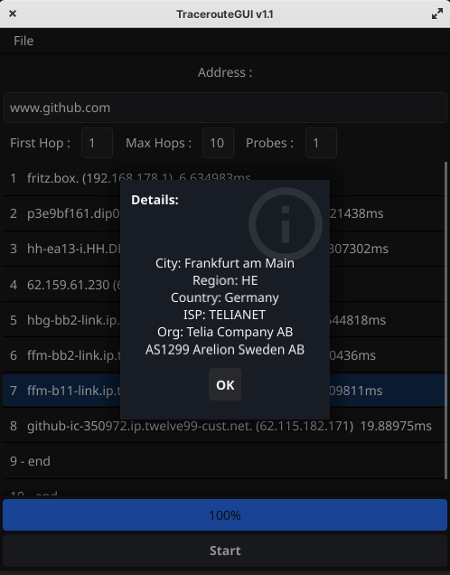

# Traceroute Tool

Traceroute Tool is a simple graphical utility built using Go and the Fyne framework.
It allows users to perform traceroute operations to diagnose network paths.

<p align="center">
   
</p>

## Features

- Perform traceroute to a specified host.
- Display the path of hops along with the elapsed time.
- Visualize the geographic location of IP addresses in the path.
- ## Version 1.1: Display ISP, Org, ASN of IP 

## Getting Started

These instructions will get you a copy of the project up and running on your local machine for development and testing purposes.

### Prerequisites

- Go 1.16 or higher
- Fyne v2.1.0 or higher

### Installation

1. Clone the repository:
   ```bash
   git clone https://github.com/lennart1978/traceroute.git
   cd traceroute
2. Build the application
   ```bash
   go build .
3. Run the application AS ROOT !
   ```bash
   sudo ./traceroute
